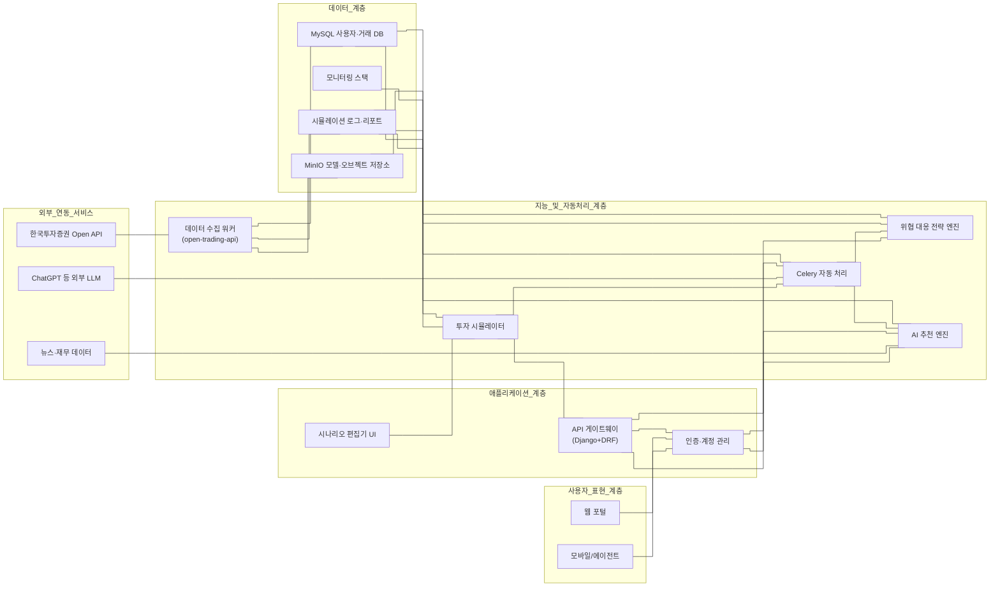

# 전체 기능 구조 개요

## 기능 모듈 및 책임

- **인증·계정 관리 (`Application Layer`)**: Django 기본 인증과 RBAC를 활용해 사용자 등록, MFA, 세션 관리, 접속 로그 수집을 담당합니다.
- **API 게이트웨이 & 시나리오 편집기**: DRF 기반 REST API와 React/Django 템플릿 UI가 투자·보안 시나리오 CRUD, 파라미터 검증, 버전 관리를 제공합니다.
- **투자 시뮬레이터**: 모의계좌 생성, 주문 실행, 체결·성과 기록을 셀프 컨테이너 서비스로 분리하고, 한국투자증권 Open API를 통한 실시간/배치 데이터를 반영합니다.
- **AI 추천 엔진 & 위협 대응 전략**: Celery 워커가 LLM 호출, 위험도 스코어링, 위협 이벤트 트리거를 수행해 사용자 맞춤 종목 추천과 대응 플랜을 생성합니다.
- **데이터 수집 워커(ETL)**: `open-trading-api` 스크립트를 자동으로 돌려 시세·재무 데이터를 가져오고 정리한 뒤 MySQL·MinIO에 저장합니다. 초반에는 수동 실행으로 시작해도 되지만, 반복 작업이 많아지면 워커로 자동화합니다.
- **데이터 관리 계층**: MySQL은 사용자·시뮬레이션·로그 스키마를 저장하고, MinIO는 모델 아티팩트·리포트·LLM 응답을 보관합니다. 주요 로그는 장기 보존을 위해 오브젝트 스토리지로 백업합니다.
- **모니터링·보안**: Prometheus/Grafana 또는 경량 익스포터를 Compose에 편입하고, Trivy 이미지 스캔·Fail2ban 방어 정책을 CI/CD와 운영 단계에 포함합니다.

### 쉬운 요약: AI 추천 엔진과 외부 LLM

- AI 추천 엔진은 우리 서비스 안에서 핵심 로직(데이터 수집, 점수 계산, 위험 감지)을 책임집니다. 즉, 기본 판단은 항상 우리 서버에서 이뤄집니다.
- ChatGPT 같은 외부 LLM은 Celery 워커가 필요할 때만 불러서 “추천 이유 설명”이나 “위협 대응 시나리오 보완”처럼 말로 풀어주는 작업을 합니다.
- 이렇게 나누면 LLM이 느리거나 실패해도 메인 추천은 계속 돌아가고, 워커가 재시도·폴백 메시지를 처리해 안정성이 높아집니다.
- 정리하면 “AI 추천 엔진 = 우리 안의 두뇌”, “외부 LLM = 설명을 도와주는 조수” 구조로 이해하면 됩니다.
- **데이터 수집 워커(ETL)**는 반복적으로 한국투자증권 API를 호출해 데이터를 모으는 자동화 스크립트입니다. 초기엔 직접 실행하면서 검증하고, 나중에 Celery로 돌리면 손이 덜 갑니다.
- **Celery 자동 처리 흐름(예전 '오케스트레이션')**은 여러 작업을 순서대로 연결해 주는 조정자입니다. “데이터 모으기 → 점수 계산 → LLM 설명”처럼 해야 할 일을 순서대로 실행해 준다고 이해하면 됩니다.

## 단계별 실행 로드맵

1. **Compose 경계 확정**: `web-frontend`, `api-gateway`, `ai-processor`, `etl-worker`, `mysql`, `redis`, `minio`, `monitoring` 컨테이너 정의와 환경 변수·볼륨 정책을 `mdfiles/docker-compose.md`에 반영합니다.
2. **Django/DRF 스켈레톤 구축**: 인증 흐름, 시나리오 CRUD, OpenAPI 문서를 제공하고, Celery·Redis 연계를 위한 초기 설정을 마련합니다.
3. **AI 자동 처리 흐름 구축**: Celery 비동기 작업으로 한국투자증권 API 데이터 적재, ChatGPT 분석, 위협 대응 룰 평가를 구현하고 로그/토큰 사용량을 추적합니다.
4. **프런트엔드 및 대시보드**: 인증 연동 UI, 시나리오 편집기, 시뮬레이션/위협 리포트 뷰어, 모니터링 패널을 단계적으로 추가하고, 실시간 알림(Channels/WebSocket)을 검토합니다.
5. **보안·운영 체계**: .env 비밀 관리, 주문 Fail-safe, 주기 백업·스냅샷, 장애 대응 체크리스트를 문서화해 단일 서버 운영 리스크를 최소화합니다.

## 3. API 제공 목록 <a id="apiList">

|구분 |API명 |모의투자 제공 여부|
|--|--|--|
|OAuth인증|웹소켓접속키발급|⭕|
|OAuth인증|접근토큰발급|⭕|
|OAuth인증|접근토큰폐기|⭕|
|OAuth인증|Hashkey|⭕|
|[국내주식]주문/계좌|주식주문(현금)|⭕|
|[국내주식]주문/계좌|주식주문(신용)| |
|[국내주식]주문/계좌|주식주문(정정취소)|⭕|
|[국내주식]주문/계좌|주식정정취소가능주문조회| |
|[국내주식]주문/계좌|주식일별주문체결조회|⭕|
|[국내주식]주문/계좌|주식잔고조회|⭕|
|[국내주식]주문/계좌|매수가능조회|⭕|
|[국내주식]주문/계좌|주식예약주문| |
|[국내주식]주문/계좌|주식예약주문정정취소| |
|[국내주식]주문/계좌|주식예약주문조회| |
|[국내주식]주문/계좌|퇴직연금 체결기준잔고| |
|[국내주식]주문/계좌|퇴직연금 미체결내역| |
|[국내주식]주문/계좌|퇴직연금 매수가능조회| |
|[국내주식]주문/계좌|퇴직연금 예수금조회| |
|[국내주식]주문/계좌|퇴직연금 잔고조회| |
|[국내주식]주문/계좌|주식잔고조회_실현손익| |
|[국내주식]주문/계좌|신용매수가능조회| |
|[국내주식]주문/계좌|투자계좌자산현황조회| |
|[국내주식]주문/계좌|기간별매매손익현황조회| |
|[국내주식]주문/계좌|기간별손익일별합산조회| |
|[국내주식]주문/계좌|매도가능수량조회| |
|[국내주식]주문/계좌|주식통합증거금 현황| |
|[국내주식]주문/계좌|기간별계좌권리현황조회| |
|[국내주식]기본시세|주식현재가 시세|⭕|
|[국내주식]기본시세|주식현재가 체결|⭕|
|[국내주식]기본시세|주식현재가 일자별|⭕|
|[국내주식]기본시세|주식현재가 호가/예상체결|⭕|
|[국내주식]기본시세|주식현재가 투자자|⭕|
|[국내주식]기본시세|주식현재가 회원사|⭕|
|[국내주식]기본시세|국내주식기간별시세(일/주/월/년)|⭕|
|[국내주식]기본시세|주식현재가 당일시간대별체결|⭕|
|[국내주식]기본시세|주식현재가 시간외일자별주가|⭕|
|[국내주식]기본시세|주식당일분봉조회|⭕|
|[국내주식]기본시세|주식일별분봉조회|⭕|
|[국내주식]기본시세|주식현재가 시세2| |
|[국내주식]기본시세|ETF/ETN 현재가| |
|[국내주식]기본시세|NAV 비교추이(종목)| |
|[국내주식]기본시세|NAV 비교추이(분)| |
|[국내주식]기본시세|NAV 비교추이(일)| |
|[국내주식]기본시세|국내주식 장마감 예상체결가| |
|[국내주식]기본시세|ETF 구성종목시세| |
|[국내주식]기본시세|국내주식 시간외현재가| |
|[국내주식]기본시세|국내주식 시간외호가| |
|[국내주식]ELW시세|ELW현재가 시세|⭕|
|[국내주식]ELW시세|ELW 상승률순위| |
|[국내주식]ELW시세|ELW 거래량순위| |
|[국내주식]ELW시세|ELW 지표순위| |
|[국내주식]ELW시세|ELW 민감도 순위| |
|[국내주식]ELW시세|ELW 당일급변종목| |
|[국내주식]ELW시세|ELW 신규상장종목| |
|[국내주식]ELW시세|ELW 투자지표추이(체결)| |
|[국내주식]ELW시세|ELW 투자지표추이(분별)| |
|[국내주식]ELW시세|ELW 투자지표추이(일별)| |
|[국내주식]ELW시세|ELW 변동성 추이(틱)| |
|[국내주식]ELW시세|ELW 변동성 추이(체결)| |
|[국내주식]ELW시세|ELW 변동성 추이(분별)| |
|[국내주식]ELW시세|ELW 변동성 추이(일별)| |
|[국내주식]ELW시세|ELW 민감도 추이(체결)| |
|[국내주식]ELW시세|ELW 민감도 추이(일별)| |
|[국내주식]ELW시세|ELW 기초자산별 종목시세| |
|[국내주식]ELW시세|ELW LP매매추이| |
|[국내주식]ELW시세|ELW 비교대상종목조회| |
|[국내주식]ELW시세|ELW 종목검색| |
|[국내주식]ELW시세|ELW 기초자산 목록조회| |
|[국내주식]ELW시세|ELW 만기예정/만기종목| |
|[국내주식]업종/기타|국내주식업종기간별시세(일/주/월/년)|⭕|
|[국내주식]업종/기타|국내휴장일조회| |
|[국내주식]업종/기타|업종분봉조회| |
|[국내주식]업종/기타|변동성완화장치(VI) 현황| |
|[국내주식]업종/기타|국내업종 현재지수| |
|[국내주식]업종/기타|국내업종 일자별지수| |
|[국내주식]업종/기타|국내업종 구분별전체시세| |
|[국내주식]업종/기타|국내주식 예상체결 전체지수| |
|[국내주식]업종/기타|국내업종 시간별지수(틱)| |
|[국내주식]업종/기타|국내업종 시간별지수(분)| |
|[국내주식]업종/기타|국내주식 예상체결지수 추이| |
|[국내주식]업종/기타|금리 종합(국내채권/금리)| |
|[국내주식]업종/기타|종합 시황/공시(제목)| |
|[국내주식]업종/기타|국내선물 영업일조회| |
|[국내주식]종목정보|상품기본조회| |
|[국내주식]종목정보|주식기본조회| |
|[국내주식]종목정보|국내주식 대차대조표| |
|[국내주식]종목정보|국내주식 손익계산서| |
|[국내주식]종목정보|국내주식 재무비율| |
|[국내주식]종목정보|국내주식 수익성비율| |
|[국내주식]종목정보|국내주식 기타주요비율| |
|[국내주식]종목정보|국내주식 안정성비율| |
|[국내주식]종목정보|국내주식 성장성비율| |
|[국내주식]종목정보|국내주식 당사 신용가능종목| |
|[국내주식]종목정보|예탁원정보(배당일정)| |
|[국내주식]종목정보|예탁원정보(주식매수청구일정)| |
|[국내주식]종목정보|예탁원정보(합병/분할일정)| |
|[국내주식]종목정보|예탁원정보(액면교체일정)| |
|[국내주식]종목정보|예탁원정보(자본감소일정)| |
|[국내주식]종목정보|예탁원정보(상장정보일정)| |
|[국내주식]종목정보|예탁원정보(공모주청약일정)| |
|[국내주식]종목정보|예탁원정보(실권주일정)| |
|[국내주식]종목정보|예탁원정보(의무예치일정)| |
|[국내주식]종목정보|예탁원정보(유상증자일정)| |
|[국내주식]종목정보|예탁원정보(무상증자일정)| |
|[국내주식]종목정보|예탁원정보(주주총회일정)| |
|[국내주식]종목정보|국내주식 종목추정실적| |
|[국내주식]종목정보|당사 대주가능 종목| |
|[국내주식]종목정보|국내주식 종목투자의견| |
|[국내주식]종목정보|국내주식 증권사별 투자의견| |
|[국내주식]시세분석|국내기관_외국인 매매종목가집계| |
|[국내주식]시세분석|종목조건검색 목록조회| |
|[국내주식]시세분석|종목조건검색조회| |
|[국내주식]시세분석|종목별 프로그램매매추이(체결)| |
|[국내주식]시세분석|종목별 프로그램매매추이(일별)| |
|[국내주식]시세분석|종목별 외인기관 추정가집계| |
|[국내주식]시세분석|종목별일별매수매도체결량| |
|[국내주식]시세분석|시장별 투자자매매동향(시세)| |
|[국내주식]시세분석|시장별 투자자매매동향(일별)| |
|[국내주식]시세분석|국내주식 신용잔고 일별추이| |
|[국내주식]시세분석|국내주식 예상체결가 추이| |
|[국내주식]시세분석|국내주식 공매도 일별추이| |
|[국내주식]시세분석|국내주식 시간외예상체결등락률| |
|[국내주식]시세분석|프로그램매매 투자자매매동향(당일)| |
|[국내주식]시세분석|프로그램매매 종합현황(시간)| |
|[국내주식]시세분석|프로그램매매 종합현황(일별)| |
|[국내주식]시세분석|외국계 매매종목 가집계| |
|[국내주식]시세분석|종목별 외국계 순매수추이| |
|[국내주식]시세분석|국내주식 체결금액별 매매비중| |
|[국내주식]시세분석|국내 증시자금 종합| |
|[국내주식]시세분석|관심종목 그룹별 종목조회| |
|[국내주식]시세분석|관심종목 그룹조회| |
|[국내주식]시세분석|관심종목(멀티종목) 시세조회| |
|[국내주식]시세분석|국내주식 상하한가 포착| |
|[국내주식]시세분석|회원사 실시간 매매동향(틱)| |
|[국내주식]시세분석|국내주식 매물대/거래비중| |
|[국내주식]시세분석|주식현재가 회원사 종목매매동향| |
|[국내주식]순위분석|거래량순위| |
|[국내주식]순위분석|국내주식 등락률 순위| |
|[국내주식]순위분석|국내주식 호가잔량 순위| |
|[국내주식]순위분석|국내주식 수익자산지표 순위| |
|[국내주식]순위분석|국내주식 시가총액 상위| |
|[국내주식]순위분석|국내주식 재무비율 순위| |
|[국내주식]순위분석|국내주식 시간외잔량 순위| |
|[국내주식]순위분석|국내주식 우선주/괴리율 상위| |
|[국내주식]순위분석|국내주식 이격도 순위| |
|[국내주식]순위분석|국내주식 시장가치 순위| |
|[국내주식]순위분석|국내주식 체결강도 상위| |
|[국내주식]순위분석|국내주식 관심종목등록 상위| |
|[국내주식]순위분석|국내주식 예상체결 상승/하락상위| |
|[국내주식]순위분석|국내주식 당사매매종목 상위| |
|[국내주식]순위분석|국내주식 신고/신저근접종목 상위| |
|[국내주식]순위분석|국내주식 대량체결건수 상위| |
|[국내주식]순위분석|국내주식 공매도 상위종목| |
|[국내주식]순위분석|국내주식 신용잔고 상위| |
|[국내주식]순위분석|국내주식 배당률 상위| |
|[국내주식]순위분석|국내주식 시간외등락율순위| |
|[국내주식]순위분석|국내주식 시간외거래량순위| |
|[국내주식]순위분석|HTS조회상위20종목| |
|[국내주식]실시간시세|국내주식 실시간체결가|⭕|
|[국내주식]실시간시세|국내주식 실시간호가|⭕|
|[국내주식]실시간시세|국내주식 실시간체결통보|⭕|
|[국내주식]실시간시세|국내지수 실시간체결| |
|[국내주식]실시간시세|국내지수 실시간예상체결| |
|[국내주식]실시간시세|국내지수 실시간프로그램매매| |
|[국내주식]실시간시세|국내주식 실시간회원사| |
|[국내주식]실시간시세|국내주식 실시간프로그램매매| |
|[국내주식]실시간시세|국내주식 장운영정보| |
|[국내주식]실시간시세|국내주식 실시간예상체결| |
|[국내주식]실시간시세|ELW 실시간체결가| |
|[국내주식]실시간시세|ELW 실시간호가| |
|[국내주식]실시간시세|국내주식 시간외 실시간체결가| |
|[국내주식]실시간시세|국내주식 시간외 실시간예상체결| |
|[국내주식]실시간시세|국내주식 시간외 실시간호가| |
|[국내주식]실시간시세|ELW 실시간예상체결| |
|[국내주식]실시간시세|국내ETF NAV추이| |
|[국내주식]실시간시세|국내주식 실시간체결가 (NXT)| |
|[국내주식]실시간시세|국내주식 실시간호가 (NXT)| |
|[국내주식]실시간시세|국내지수 실시간예상체결 (NXT)| |
|[국내주식]실시간시세|국내지수 실시간프로그램매매 (NXT)| |
|[국내주식]실시간시세|국내주식 실시간회원사 (NXT)| |
|[국내주식]실시간시세|국내주식 장운영정보 (NXT)| |
|[국내주식]실시간시세|국내주식 실시간체결가 (통합)||
|[국내주식]실시간시세|국내주식 실시간호가 (통합)||
|[국내주식]실시간시세|국내지수 실시간예상체결 (통합)| |
|[국내주식]실시간시세|국내지수 실시간프로그램매매 (통합)| |
|[국내주식]실시간시세|국내주식 실시간회원사 (통합)| |
|[국내주식]실시간시세|국내주식 장운영정보 (통합)| |
|[국내선물옵션]주문/계좌|선물옵션 주문|⭕|
|[국내선물옵션]주문/계좌|선물옵션 정정취소주문|⭕|
|[국내선물옵션]주문/계좌|선물옵션 주문체결내역조회|⭕|
|[국내선물옵션]주문/계좌|선물옵션 잔고현황|⭕|
|[국내선물옵션]주문/계좌|선물옵션 주문가능|⭕|
|[국내선물옵션]주문/계좌|(야간)선물옵션 주문체결내역조회| |
|[국내선물옵션]주문/계좌|(야간)선물옵션 잔고현황| |
|[국내선물옵션]주문/계좌|(야간)선물옵션 주문가능| |
|[국내선물옵션]주문/계좌|선물옵션 잔고정산손익내역| |
|[국내선물옵션]주문/계좌|선물옵션 총자산현황| |
|[국내선물옵션]주문/계좌|선물옵션 잔고평가손익내역| |
|[국내선물옵션]주문/계좌|선물옵션 기준일체결내역| |
|[국내선물옵션]주문/계좌|선물옵션기간약정수수료일별| |
|[국내선물옵션]주문/계좌|(야간)선물옵션 증거금 상세| |
|[국내선물옵션]기본시세|선물옵션 시세|⭕|
|[국내선물옵션]기본시세|선물옵션 시세호가|⭕|
|[국내선물옵션]기본시세|선물옵션기간별시세(일/주/월/년)|⭕|
|[국내선물옵션]기본시세|선물옵션 분봉조회| |
|[국내선물옵션]기본시세|선물옵션 일중예상체결추이| |
|[국내선물옵션]기본시세|국내선물 기초자산 시세|⭕|
|[국내선물옵션]기본시세|국내옵션전광판_옵션월물리스트| |
|[국내선물옵션]기본시세|국내옵션전광판_선물| |
|[국내선물옵션]기본시세|국내옵션전광판_콜풋| |
|[국내선물옵션]실시간시세|지수선물 실시간체결가| |
|[국내선물옵션]실시간시세|지수선물 실시간호가| |
|[국내선물옵션]실시간시세|선물옵션 실시간체결 통보| |
|[국내선물옵션]실시간시세|지수옵션 실시간체결가| |
|[국내선물옵션]실시간시세|지수옵션 실시간호가| |
|[국내선물옵션]실시간시세|상품선물 실시간체결가| |
|[국내선물옵션]실시간시세|상품선물 실시간호가| |
|[국내선물옵션]실시간시세|주식선물 실시간체결가| |
|[국내선물옵션]실시간시세|주식선물 실시간호가| |
|[국내선물옵션]실시간시세|주식옵션 실시간체결가| |
|[국내선물옵션]실시간시세|주식옵션 실시간호가| |
|[국내선물옵션]실시간시세|지수선물 실시간체결가| |
|[국내선물옵션]실시간시세|지수선물 실시간호가| |
|[국내선물옵션]실시간시세|선물옵션 실시간체결 통보|⭕|
|[국내선물옵션]실시간시세|지수옵션 실시간체결가| |
|[국내선물옵션]실시간시세|지수옵션 실시간호가| |
|[국내선물옵션]실시간시세|상품선물 실시간체결가| |
|[국내선물옵션]실시간시세|상품선물 실시간호가| |
|[국내선물옵션]실시간시세|주식선물 실시간체결가| |
|[국내선물옵션]실시간시세|주식선물 실시간호가| |
|[국내선물옵션]실시간시세|주식선물 실시간예상체결| |
|[국내선물옵션]실시간시세|주식옵션 실시간체결가| |
|[국내선물옵션]실시간시세|주식옵션 실시간호가| |
|[국내선물옵션]실시간시세|주식옵션 실시간예상체결| |
|[국내선물옵션]실시간시세|KRX야간옵션 실시간체결가| |
|[국내선물옵션]실시간시세|KRX야간옵션 실시간호가| |
|[국내선물옵션]실시간시세|KRX야간옵션 실시간예상체결| |
|[국내선물옵션]실시간시세|KRX야간옵션 실시간체결통보| |
|[국내선물옵션]실시간시세|CME야간선물 실시간체결가| |
|[국내선물옵션]실시간시세|CME야간선물 실시간호가| |
|[국내선물옵션]실시간시세|CME야간선물 실시간체결통보| |
|[해외주식]주문/계좌|해외주식 주문|⭕|
|[해외주식]주문/계좌|해외주식 정정취소주문|⭕|
|[해외주식]주문/계좌|해외주식 예약주문접수|⭕|
|[해외주식]주문/계좌|해외주식 예약주문접수취소|⭕|
|[해외주식]주문/계좌|해외주식 미체결내역|⭕|
|[해외주식]주문/계좌|해외주식 잔고|⭕|
|[해외주식]주문/계좌|해외주식 주문체결내역|⭕|
|[해외주식]주문/계좌|해외주식 체결기준현재잔고|⭕|
|[해외주식]주문/계좌|해외주식 예약주문조회| |
|[해외주식]주문/계좌|해외주식 매수가능금액조회| |
|[해외주식]주문/계좌|해외주식 미국주간주문| |
|[해외주식]주문/계좌|해외주식 미국주간정정취소| |
|[해외주식]주문/계좌|해외주식 기간손익| |
|[해외주식]주문/계좌|해외증거금 통화별조회| |
|[해외주식]주문/계좌|해외주식 일별거래내역| |
|[해외주식]주문/계좌|해외주식 결제기준잔고| |
|[해외주식]주문/계좌|해외주식 지정가체결내역조회| |
|[해외주식]주문/계좌|해외주식 지정가주문번호조회| |
|[해외주식]기본시세|해외주식 현재체결가|⭕|
|[해외주식]기본시세|해외주식 기간별시세|⭕|
|[해외주식]기본시세|해외주식 종목/지수/환율기간별시세(일/주/월/년)|⭕|
|[해외주식]기본시세|해외주식 조건검색|⭕|
|[해외주식]기본시세|해외결제일자조회| |
|[해외주식]기본시세|해외주식 현재가상세| |
|[해외주식]기본시세|해외주식분봉조회| |
|[해외주식]기본시세|해외지수분봉조회| |
|[해외주식]기본시세|해외주식 상품기본정보| |
|[해외주식]기본시세|해외주식 현재가 1호가| |
|[해외주식]기본시세|해외주식 업종별코드조회| |
|[해외주식]기본시세|해외주식 업종별시세| |
|[해외주식]시세분석|해외주식 기간별권리조회| |
|[해외주식]시세분석|해외뉴스종합(제목)| |
|[해외주식]시세분석|해외주식 권리종합| |
|[해외주식]시세분석|당사 해외주식담보대출 가능 종목| |
|[해외주식]시세분석|해외속보(제목)| |
|[해외주식]시세분석|해외주식 거래증가율순위| |
|[해외주식]시세분석|해외주식 가격급등락| |
|[해외주식]시세분석|해외주식 거래대금순위| |
|[해외주식]시세분석|해외주식 거래량급증| |
|[해외주식]시세분석|해외주식 신고/신저가| |
|[해외주식]시세분석|해외주식 매수체결강도상위| |
|[해외주식]시세분석|해외주식 거래회전율순위| |
|[해외주식]시세분석|해외주식 시가총액순위| |
|[해외주식]시세분석|해외주식 상승율/하락율| |
|[해외주식]실시간시세|해외주식 실시간호가| |
|[해외주식]실시간시세|해외주식 지연호가(아시아)| |
|[해외주식]실시간시세|해외주식 실시간지연체결가| |
|[해외주식]실시간시세|해외주식 실시간체결통보| |
|[해외선물옵션]주문/계좌|해외선물옵션 주문| |
|[해외선물옵션]주문/계좌|해외선물옵션 정정취소주문| |
|[해외선물옵션]주문/계좌|해외선물옵션 당일주문내역조회| |
|[해외선물옵션]주문/계좌|해외선물옵션 미결제내역조회(잔고)| |
|[해외선물옵션]주문/계좌|해외선물옵션 주문가능조회| |
|[해외선물옵션]주문/계좌|해외선물옵션 기간계좌손익 일별| |
|[해외선물옵션]주문/계좌|해외선물옵션 일별 체결내역| |
|[해외선물옵션]주문/계좌|해외선물옵션 예수금현황| |
|[해외선물옵션]주문/계좌|해외선물옵션 일별 주문내역| |
|[해외선물옵션]주문/계좌|해외선물옵션 기간계좌거래내역| |
|[해외선물옵션]주문/계좌|해외선물옵션 증거금상세| |
|[해외선물옵션]기본시세|해외선물종목상세|⭕|
|[해외선물옵션]기본시세|해외선물종목현재가|⭕|
|[해외선물옵션]기본시세|해외선물 분봉조회| |
|[해외선물옵션]기본시세|해외선물 체결추이(주간)| |
|[해외선물옵션]기본시세|해외선물 체결추이(일간)| |
|[해외선물옵션]기본시세|해외선물 체결추이(틱)| |
|[해외선물옵션]기본시세|해외선물 체결추이(월간)| |
|[해외선물옵션]기본시세|해외선물 호가| |
|[해외선물옵션]기본시세|해외선물 상품기본정보| |
|[해외선물옵션]기본시세|해외선물 장운영시간| |
|[해외선물옵션]기본시세|해외선물 미결제추이| |
|[해외선물옵션]기본시세|해외옵션 호가| |
|[해외선물옵션]실시간시세|해외선물옵션 실시간체결가| |
|[해외선물옵션]실시간시세|해외선물옵션 실시간호가| |
|[해외선물옵션]실시간시세|해외선물옵션 실시간주문내역통보| |
|[해외선물옵션]실시간시세|해외선물옵션 실시간체결내역통보| |
|[장내채권]주문/계좌|장내채권 매도주문| |
|[장내채권]주문/계좌|장내채권 매수주문| |
|[장내채권]주문/계좌|장내채권 정정취소주문| |
|[장내채권]주문/계좌|채권정정취소가능주문조회| |
|[장내채권]주문/계좌|장내채권 주문체결내역| |
|[장내채권]주문/계좌|장내채권 잔고조회| |
|[장내채권]주문/계좌|장내채권 매수가능조회| |
|[장내채권]기본시세|장내채권 발행정보| |
|[장내채권]기본시세|장내채권 기본조회| |
|[장내채권]기본시세|장내채권현재가(호가)| |
|[장내채권]기본시세|장내채권 평균단가조회| |
|[장내채권]기본시세|장내채권 기간별시세(일)| |
|[장내채권]기본시세|장내채권현재가(시세)| |
|[장내채권]기본시세|장내채권현재가(체결)| |
|[장내채권]기본시세|장내채권현재가(일별)| |
|[장내채권]실시간시세|일반채권 실시간체결가| |
|[장내채권]실시간시세|일반채권 실시간호가| |
|[장내채권]실시간시세|채권지수 실시간체결가| |

## 4. API 예제 목록

|구분|예제명|언어|상세|
|--|--|--|--|
|Sample01|kis_api01.py|python|[국내주식] 주문/계좌조회/시세 호출|
|Sample01|kis_api02.py|python|[국내선물옵션] 주문/계좌조회/시세 호출|
|Sample01|kis_api03.py|python|[해외주식] 주문/계좌조회/시세 호출|
|Sample01|kis_api04.py|python|[해외선물옵션] 주문/계좌조회/시세 호출|
|Sample01|kis_auth.py|python|토큰 발급 관리 및 공통 샘플|
|Sample01|kis_devlp.yaml|yaml|사용자 환경 샘플|
|Sample01|kis_domfuopt.py|python|[국내선물옵션] 주문/계좌조회/시세 함수|
|Sample01|kis_domstk.py|python|[국내주식] 주문/계좌조회/시세 함수|
|Sample01|kis_domstk_ws.py|python|[국내주식] 실시간(웹소켓) 체결/호가/계좌체결발생+REST 호출 함수|
|Sample01|kis_ovrseafuopt.py|python|[해외선물옵션] 주문/계좌조회/시세 함수|
|Sample01|kis_ovrseafuopt_ws.py|python|[해외선물옵션] 실시간(웹소켓) 체결/호가/계좌주문내역발생/계좌체결발생+REST 호출 함수|
|Sample01|kis_ovrseastk.py|python|[해외주식] 주문/계좌조회/시세 함수|
|Sample01|kis_ovrseastk_ws.py|python|[해외주식] 실시간(웹소켓) 체결/호가/계좌체결발생+REST 호출 함수|
|rest|current_price_sample.py|python|국내주식 현재가 조회 샘플|
|rest|get_interest_stocks_price.py|python|관심 종목 복수 시세 조회 샘플|
|rest|get_ovsfut_chart_price.py|python|해외선물 분봉 다음 조회 샘플|
|rest|get_ovsstk_chart_price.py|python|해외주식 분봉 다음 조회 샘플|
|rest|kis_api.py|python|국내주식 주문 샘플|
|rest|kis_auth.py|python|OAuth 접근 토큰 발급 및 갱신 관련 인증 관리|
|websocket|ops_ws_sample.py|python|국내주식 웹소켓 연결|
|websocket|ws_commodity_future.py|python|상품선물옵션 실시간시세 일회성 구독|
|websocket|ws_domestic+overseas_stock.py|python|국내/해외주식 실시간시세 일회성 구독|
|websocket|ws_domestic_future.py|python|국내주식 실시간시세 일회성 구독|
|websocket|ws_domestic_overseas_all.py|python|국내/해외·주식/선물옵션, 장내채권 실시간시세 일회성 구독|
|websocket|ws_domestic_stock.py|python|국내주식 실시간시세 일회성 구독|
|websocket|ws_overseas_future.py|python|해외선물옵션 실시간시세 일회성 구독|
|websocket|ws_overseas_stock.py|python|해외주식 실시간시세 일회성 구독|