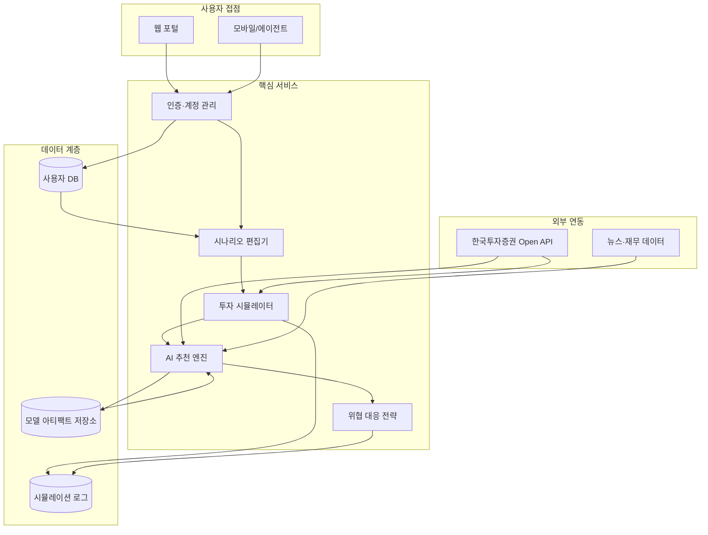

# 전체 기능 구조 개요

## 구현 예정 핵심 기능

- **인증·계정 관리**: 회원가입, 로그인, 권한 관리, 접속 로그 모니터링.
- **시나리오 편집기**: 예산, 보안 위협, 시장 급변 이벤트 등 조건을 구성하는 GUI·폼.
- **투자 시뮬레이터**: 가상 자금 계좌 생성, 주문 실행, 체결 로그 축적, 성과 분석.
- **AI 추천 엔진**: 한국투자증권 Open API와 외부 데이터(뉴스, 재무정보)를 활용한 종목 추천·위험도 스코어 산출.
- **위협 대응 전략 모듈**: 보안 위협 또는 시장 급변 시나리오에 따른 대응 방안 시뮬레이션 및 알림.
- **데이터 관리**: MySQL 기반 사용자·시뮬레이션 데이터, MinIO/S3 기반 모델·리포트 저장.
- **모니터링·리포팅**: 대시보드, 리포트 생성, 주요 지표 알림 및 히스토리 관리.
