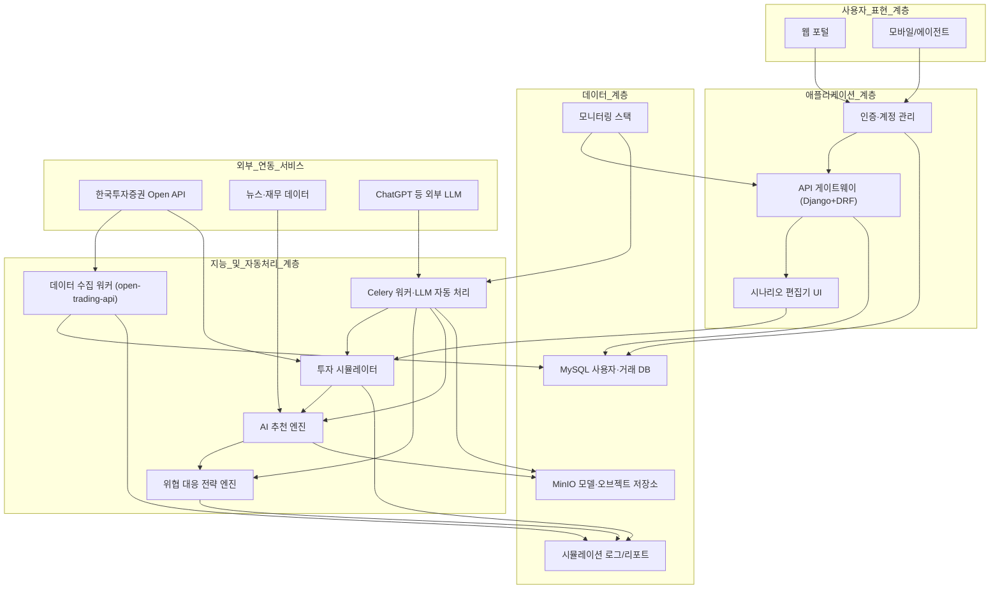

# 전체 기능 구조 개요

## 기능 모듈 및 책임

- **인증·계정 관리 (`Application Layer`)**: Django 기본 인증과 RBAC를 활용해 사용자 등록, MFA, 세션 관리, 접속 로그 수집을 담당합니다.
- **API 게이트웨이 & 시나리오 편집기**: DRF 기반 REST API와 React/Django 템플릿 UI가 투자·보안 시나리오 CRUD, 파라미터 검증, 버전 관리를 제공합니다.
- **투자 시뮬레이터**: 모의계좌 생성, 주문 실행, 체결·성과 기록을 셀프 컨테이너 서비스로 분리하고, 한국투자증권 Open API를 통한 실시간/배치 데이터를 반영합니다.
- **AI 추천 엔진 & 위협 대응 전략**: Celery 워커가 LLM 호출, 위험도 스코어링, 위협 이벤트 트리거를 수행해 사용자 맞춤 종목 추천과 대응 플랜을 생성합니다.
- **데이터 수집 워커(ETL)**: `open-trading-api` 스크립트를 자동으로 돌려 시세·재무 데이터를 가져오고 정리한 뒤 MySQL·MinIO에 저장합니다. 초반에는 수동 실행으로 시작해도 되지만, 반복 작업이 많아지면 워커로 자동화합니다.
- **데이터 관리 계층**: MySQL은 사용자·시뮬레이션·로그 스키마를 저장하고, MinIO는 모델 아티팩트·리포트·LLM 응답을 보관합니다. 주요 로그는 장기 보존을 위해 오브젝트 스토리지로 백업합니다.
- **모니터링·보안**: Prometheus/Grafana 또는 경량 익스포터를 Compose에 편입하고, Trivy 이미지 스캔·Fail2ban 방어 정책을 CI/CD와 운영 단계에 포함합니다.

### 쉬운 요약: AI 추천 엔진과 외부 LLM

- AI 추천 엔진은 우리 서비스 안에서 핵심 로직(데이터 수집, 점수 계산, 위험 감지)을 책임집니다. 즉, 기본 판단은 항상 우리 서버에서 이뤄집니다.
- ChatGPT 같은 외부 LLM은 Celery 워커가 필요할 때만 불러서 “추천 이유 설명”이나 “위협 대응 시나리오 보완”처럼 말로 풀어주는 작업을 합니다.
- 이렇게 나누면 LLM이 느리거나 실패해도 메인 추천은 계속 돌아가고, 워커가 재시도·폴백 메시지를 처리해 안정성이 높아집니다.
- 정리하면 “AI 추천 엔진 = 우리 안의 두뇌”, “외부 LLM = 설명을 도와주는 조수” 구조로 이해하면 됩니다.
- **데이터 수집 워커(ETL)**는 반복적으로 한국투자증권 API를 호출해 데이터를 모으는 자동화 스크립트입니다. 초기엔 직접 실행하면서 검증하고, 나중에 Celery로 돌리면 손이 덜 갑니다.
- **Celery 자동 처리 흐름(예전 '오케스트레이션')**은 여러 작업을 순서대로 연결해 주는 조정자입니다. “데이터 모으기 → 점수 계산 → LLM 설명”처럼 해야 할 일을 순서대로 실행해 준다고 이해하면 됩니다.

## 단계별 실행 로드맵

1. **Compose 경계 확정**: `web-frontend`, `api-gateway`, `ai-processor`, `etl-worker`, `mysql`, `redis`, `minio`, `monitoring` 컨테이너 정의와 환경 변수·볼륨 정책을 `mdfiles/docker-compose.md`에 반영합니다.
2. **Django/DRF 스켈레톤 구축**: 인증 흐름, 시나리오 CRUD, OpenAPI 문서를 제공하고, Celery·Redis 연계를 위한 초기 설정을 마련합니다.
3. **AI 자동 처리 흐름 구축**: Celery 비동기 작업으로 한국투자증권 API 데이터 적재, ChatGPT 분석, 위협 대응 룰 평가를 구현하고 로그/토큰 사용량을 추적합니다.
4. **프런트엔드 및 대시보드**: 인증 연동 UI, 시나리오 편집기, 시뮬레이션/위협 리포트 뷰어, 모니터링 패널을 단계적으로 추가하고, 실시간 알림(Channels/WebSocket)을 검토합니다.
5. **보안·운영 체계**: .env 비밀 관리, 주문 Fail-safe, 주기 백업·스냅샷, 장애 대응 체크리스트를 문서화해 단일 서버 운영 리스크를 최소화합니다.
